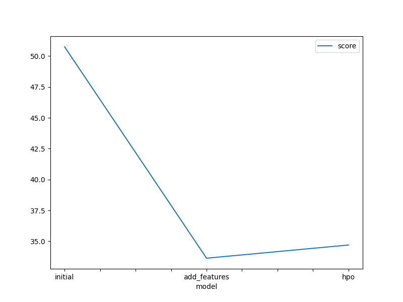
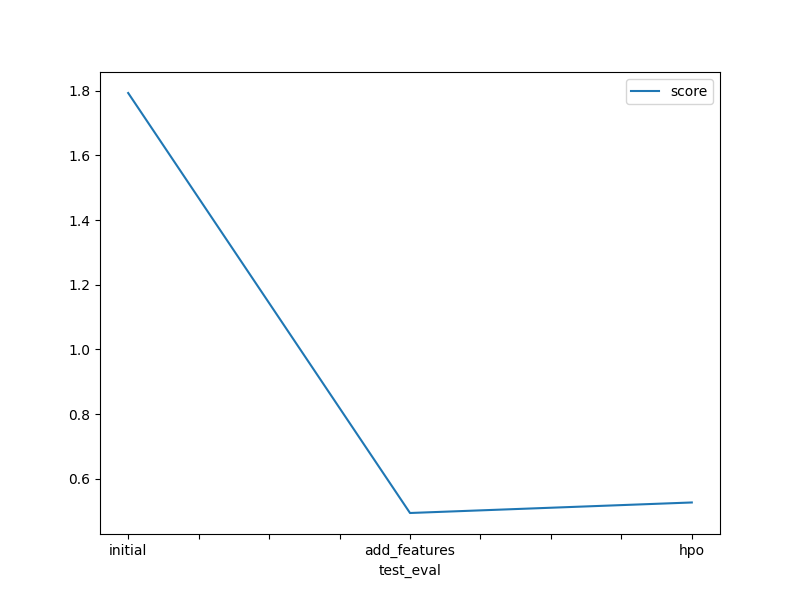

# Report: Predict Bike Sharing Demand with AutoGluon Solution
#### Htwe Eaint Phyu

## Initial Training
### What did you realize when you tried to submit your predictions? What changes were needed to the output of the predictor to submit your results?
Since the predictor might predict the output as negative values and Kaggle doesn't accept the negative values for submission, I have to change the negative values to positive before submitting. 

### What was the top ranked model that performed?
WeightedEnsemble_L3

## Exploratory data analysis and feature creation
### What did the exploratory analysis find and how did you add additional features?
I have parsed the datetime and divided it into year, month, hour and weekday. Moreover, datetime column was dropped as it is no longer useful. Season and weather were initially integer data type but since they are categorical values, they were transformed into categorical type.

### How much better did your model preform after adding additional features and why do you think that is?
The original datetime is like a string value which model couldn't quite understand and splitting datetime into integer-typed features is more effective for training model. Additional features like day, month, hour and weekday will also help to capture the seasonal trends and patterns.

## Hyper parameter tuning
### How much better did your model preform after trying different hyper parameters?
The model performance improved after trying hyper parameter tuning as its highest model scored 34.702 whereas the initial model scored only 50.750 in RMSE. 

### If you were given more time with this dataset, where do you think you would spend more time?
I would spend more time in EDA like feature extraction and feature understanding using different plots and I would research how algorithms behind each model works to be a help in hyper parameter tuning.

### Create a table with the models you ran, the hyperparameters modified, and the kaggle score.
|model|hpo1|hpo2|hpo3|score|
|--|--|--|--|--|
|initial|default|default|default|1.7928|
|add_features|default|default|default|0.4940|
|hpo|RF(n_estimators: 100, max_depth: 8, min_samples_split: 2)|GBM(extra_trees: True, num_boost_round: ag.space.Int(lower=100, upper=800, default=100), num_leaves: ag.space.Int(lower=26, upper=66, default=36),ag_args: {name_suffix: XT}}, {}, GBMLarge)|default|0.5266|

### Create a line plot showing the top model score for the three (or more) training runs during the project.

### Create a line plot showing the top kaggle score for the three (or more) prediction submissions during the project.

## Summary
This project explored using AutoGluon, an automated machine learning library, to predict bike sharing demand. Here's a breakdown of the key steps:

- Data Acquisition and Preparation:

Obtained the bike sharing demand dataset from Kaggle.
Performed necessary data cleaning and preprocessing steps (e.g., converting categorical features, feature extraction).

- AutoGluon Model Training:

Utilized AutoGluon's TabularPredictor class to create a machine learning model for regression.
Configured the model with appropriate parameters:
Defined the target variable (e.g., "count") for predicting demand.
Set the evaluation metric (e.g., "rmse") to evaluate model performance on unseen data.
Explored AutoGluon's presets (e.g., "best_quality") to achieve the highest possible model performance.
custom hyperparameters for individual models within AutoGluon (e.g., LightGBM, Random Forest) to improve model performance.
Trained the model using the fit method, providing the prepared training data.

- Kaggle Submission

Used the trained model to make predictions on the Kaggle competition's test data.
Exported the predictions in the required format (e.g., CSV with "datetime" and "count" columns).
Submitted the predictions to the Kaggle competition to evaluate your model's performance against other participants.

Overall, this project demonstrates the feasibility of leveraging AutoGluon for bike sharing demand prediction and highlights the potential for further improvements through hyperparameter tuning and model selection techniques.

